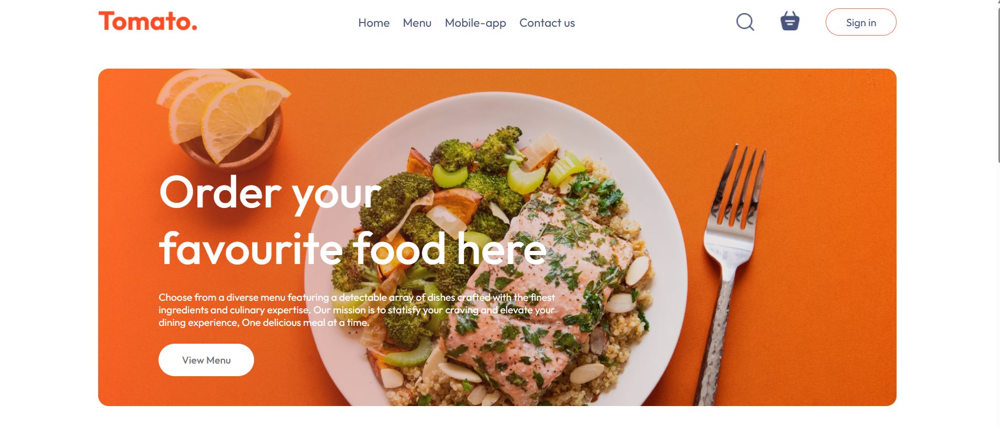
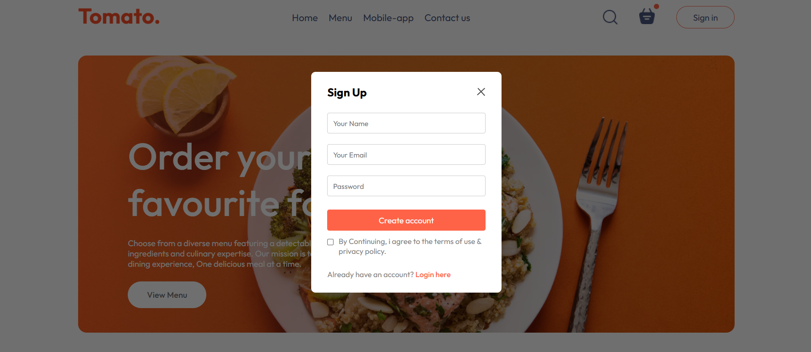
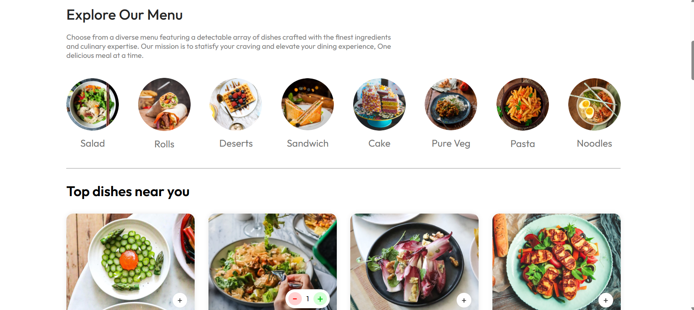
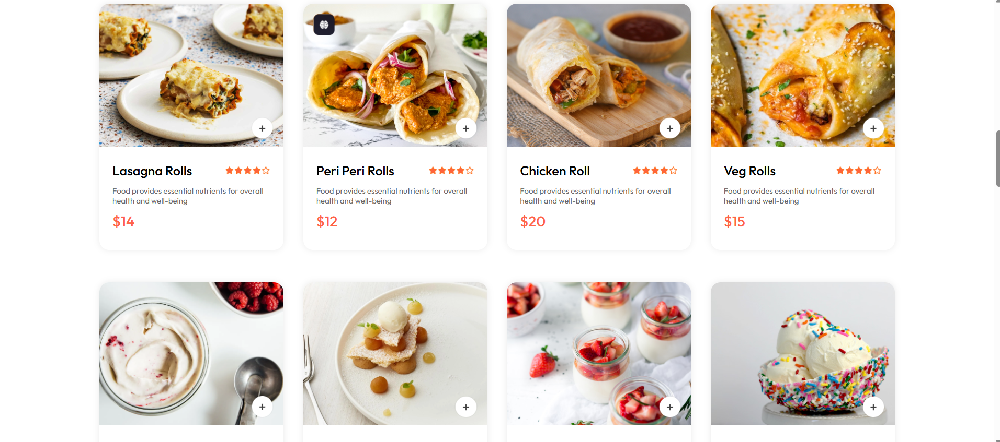
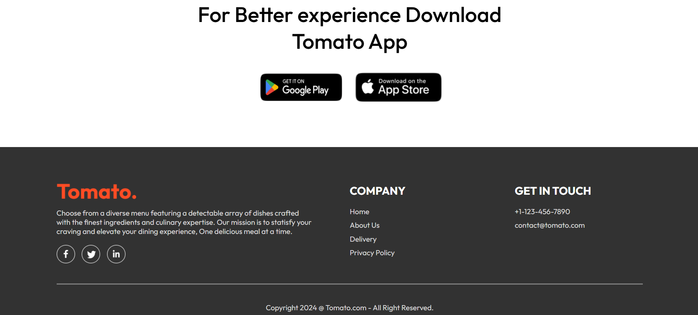
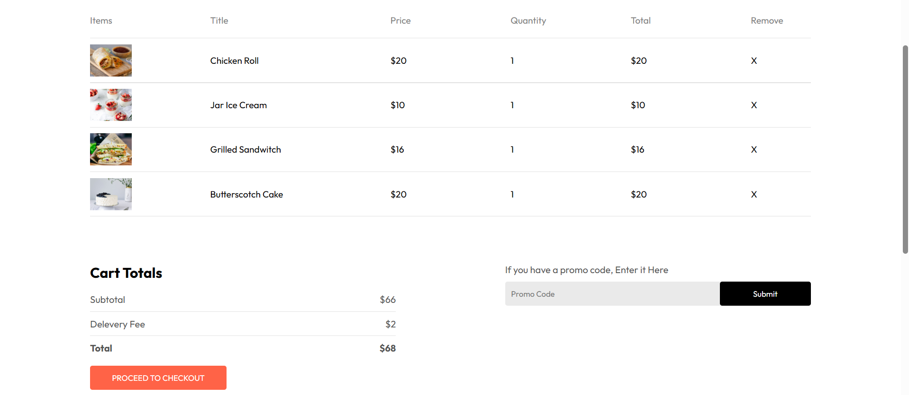
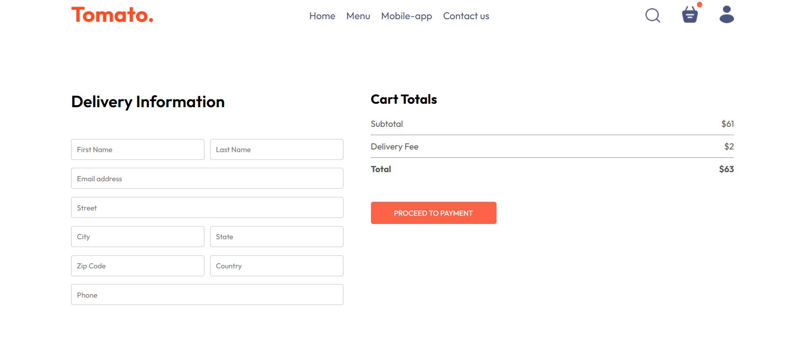
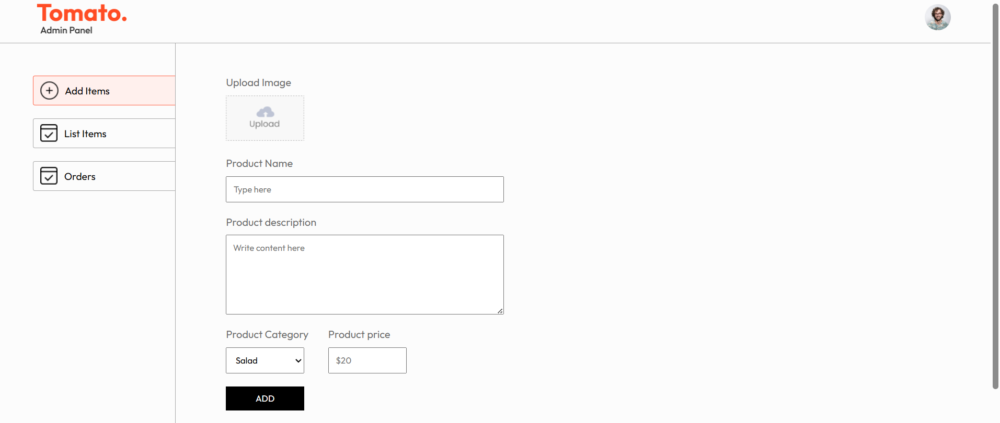
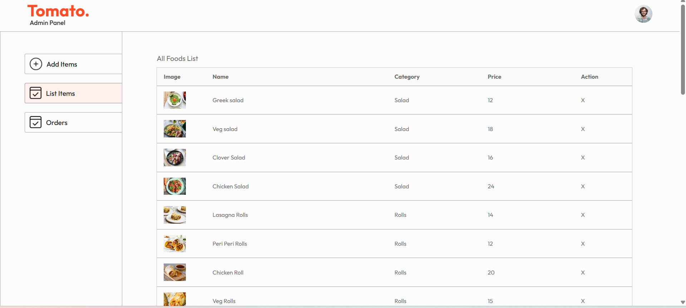
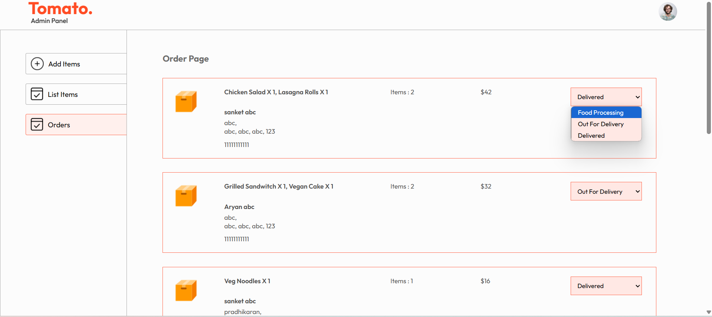

# 🍽️ Full Stack Food Delivery Website

A complete **Food Ordering Web Application** built using the **MERN Stack** (MongoDB, Express.js, React.js, Node.js) with **Razorpay** integration for seamless online payments. The project includes a fully functional **User Panel** for placing orders and an **Admin Panel** for managing items and tracking orders.

Whether you want to place an order, track delivery, or manage your food items as an admin, this project has it all covered.

---

## 🔥 Key Features

### 👤 User Side
- 🔐 Authentication (Signup/Login)
- 🍔 Browse Food Items by Category
- 🔍 Product Details & Filtering
- 🛒 Add/Remove Items to Cart
- 💳 Online Payment via Razorpay
- 📦 Track Order Status in Real-Time
- 🧾 View Past Orders

### 👨‍💼 Admin Panel
- 📋 Add / Update / Delete Food Items
- 🧑‍💻 Manage Users & Orders
- ✅ Change Order Status (Pending → Processing → Delivered)

---

## 🧰 Tech Stack

### 🖥️ Frontend
- ⚛️ **React.js** – Building user interfaces
- 🎨 **CSS** – Utility-first CSS for fast styling
- 🎯 **Context API** – Managing global state
- 🌐 **Axios** – HTTP requests to backend

### 🛠️ Backend
- 🧠 **Node.js** – JavaScript runtime environment
- 🚂 **Express.js** – Web application framework

### 🗃️ Database
- 🍃 **MongoDB** – NoSQL database
- 🧩 **Mongoose** – MongoDB ODM for Node.js

### 🔐 Authentication
- 🔑 **JWT (JSON Web Tokens)** – Secure user sessions
- 🛡️ **Middleware** – Route protection & role-based access

### 💳 Payments
- 💰 **Razorpay** – Payment gateway integration

### ☁️ Deployment

- 🔧 **Render** – Hosting  for React frontend and backend services

---

## 📷 Screenshots

### 🏠 Home Page  

### 🔐 SignUp/Login Page  

### 🍽️ Menu  

### 🍲 Various Dishes  

### 👣 Footer  

### 🛒 Cart items and Cart Total  

### 🚚 Delivery Information  

### 🧑‍🍳 Admin Panel - Add Items  

### 📋 Admin Panel - Item List  

### 📦 Admin Panel - Orders Overview  

